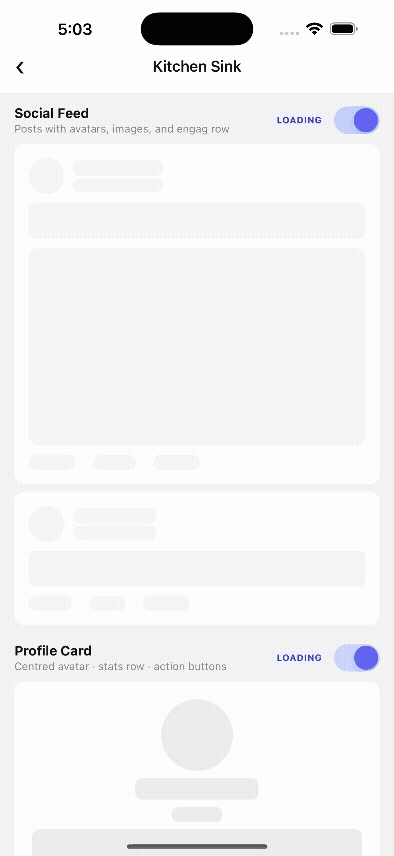
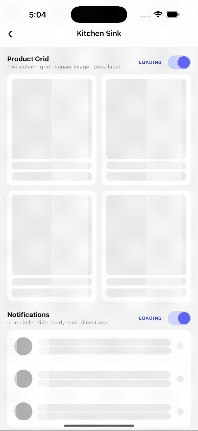
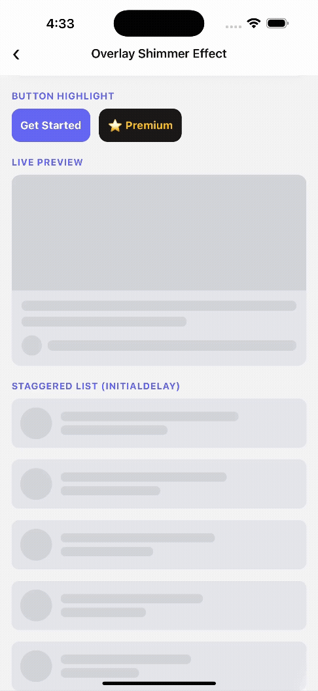
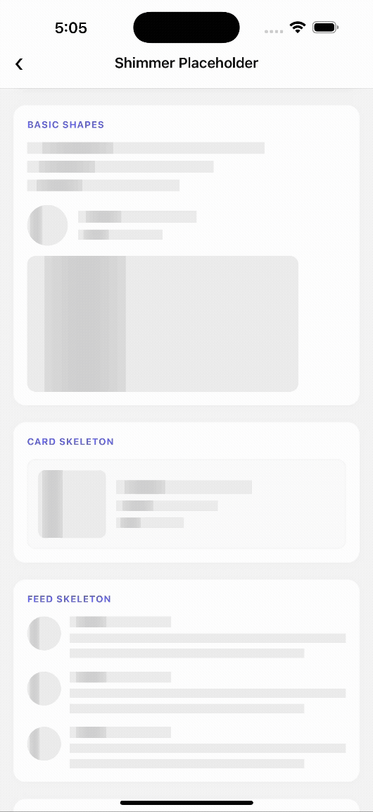
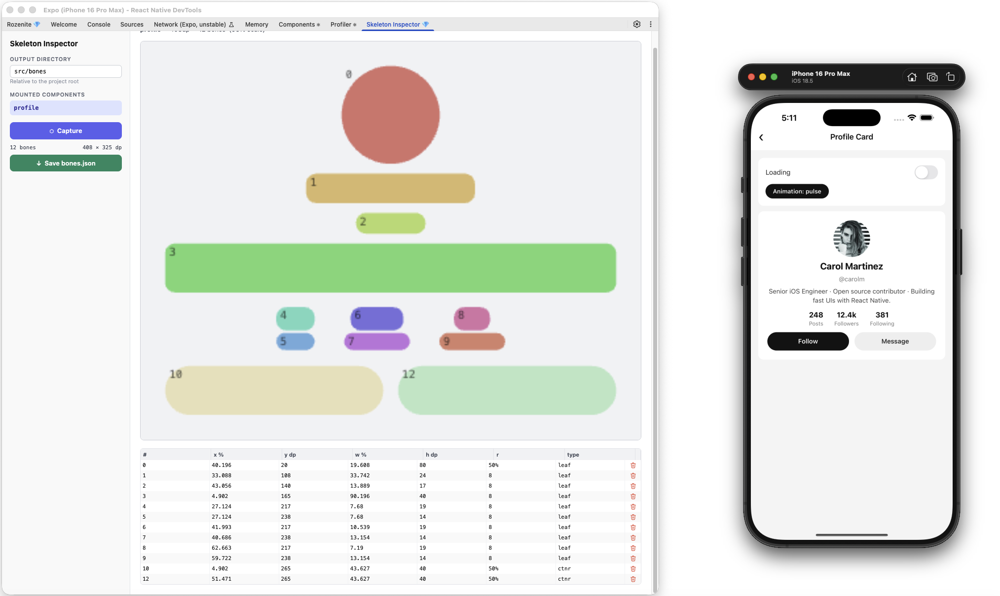
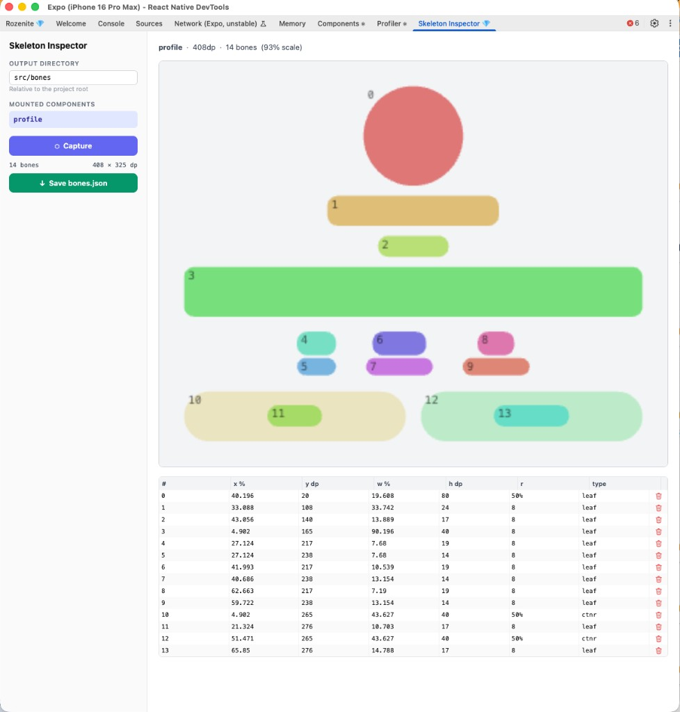

<div align="center">


### Stop hand-coding skeleton screens. Capture them from your real UI in one click.

[](https://www.npmjs.com/package/react-native-auto-shimmer)
[](https://www.npmjs.com/package/react-native-auto-shimmer)
[](LICENSE)
[](https://reactnative.dev)
[](https://expo.dev)
[](CONTRIBUTING.md)

<br/>

**⭐ If this saves you time, star the repo — it takes 2 seconds and helps others find it.**

<br/>

<table>
<tr>
<td align="center" width="25%">

**Auto Pulse**


</td>
<td align="center" width="25%">

**Auto Shimmer**


</td>
<td align="center" width="25%">

**ShimmerOverlay**


</td>
<td align="center" width="25%">

**ShimmerPlaceholder**


</td>
</tr>
<tr>
<td align="center">Auto-captured from live UI</td>
<td align="center">Auto-captured from live UI</td>
<td align="center">Wrap any element</td>
<td align="center">Fixed-size box</td>
</tr>
</table>

</div>

---

## The problem with skeleton screens today

Every React Native developer has been here:

```
🤦 "OK let me eyeball this card width... maybe 340px? Let me check on a different device..."
🤦 "The design changed again. Rebuild all the skeletons."
🤦 "Why does the skeleton not match the real layout on iPad?"
```

Building skeletons by hand is a time sink that should not exist. **react-native-auto-shimmer fixes this permanently.**

---

## How it works (30 seconds)



<div align="center">

*The Skeleton Inspector DevTools panel — click Capture, get pixel-perfect skeletons instantly*

</div>

1. **Wrap** your component with `<SkeletonCapture name="card">`
2. **Open** Skeleton Inspector in React Native DevTools
3. **Click Capture** — real skeleton geometry is measured from the live fiber tree
4. **Delete** any unwanted pieces with the trash icon
5. **Save** — a TypeScript file lands in `src/skeletons/` with a ready-to-paste code snippet
6. **Done** — skeletons that match your UI exactly, on every device size

No guessing. No hardcoding. No drift.

---

## Three ways to use it

<div align="center">

| | **Auto Shimmer** ⭐ Primary | **ShimmerOverlay** | **ShimmerPlaceholder** |
|---|---|---|---|
| **What** | Skeleton from live UI, zero manual work | Shimmer sweep over any element | Fixed-size shimmer box |
| **Layout** | Measured from real component | Wraps whatever you give it | You set `width` / `height` |
| **Responsive** | ✅ % widths, any screen | — | ❌ Fixed px |
| **Setup** | One-time DevTools capture | Wrap & go | Drop in |
| **Use when** | Building loading screens | Shine/highlight effects | Simple one-off placeholders |

</div>

> **Start with Auto Shimmer.** Drop to the manual options only for quick one-offs or pure visual effects.

---

## Installation

```sh
npm install react-native-auto-shimmer
# or
yarn add react-native-auto-shimmer
```

> No native modules · No `pod install` · No Gradle changes · Works with Expo · React Native ≥ 0.68

---

# Auto Shimmer ⭐

> The main event. Capture pixel-perfect skeleton layouts directly from your running UI — no measurement, no guesswork.

## Before vs. After

```diff
- // 😩 The old way
- const SkeletonCard = () => (
-   <View style={{ width: 340, height: 180, backgroundColor: '#e0e0e0' }} />
-   <View style={{ width: 280, height: 18,  backgroundColor: '#e0e0e0', marginTop: 16 }} />
-   <View style={{ width: 200, height: 14,  backgroundColor: '#e0e0e0', marginTop: 8  }} />
-   // ... and redo all of this every time the design changes
- );

+ // ✅ With react-native-auto-shimmer
+ <Skeleton loading={loading} name="card" style={styles.card}>
+   <ArticleCard />
+ </Skeleton>
```

## Setup

### 1 — Install dev dependencies

```sh
yarn add -D @rozenite/metro react-native-auto-shimmer-rozenite-plugin
```

### 2 — Configure Metro

```js
// metro.config.js
const { getDefaultConfig } = require('@expo/metro-config'); // or require('metro-config')
const { withRozenite } = require('@rozenite/metro');
const { withSkeletonInspector } = require('react-native-auto-shimmer-rozenite-plugin/metro');

let config = getDefaultConfig(__dirname);
config = withSkeletonInspector(config);

if (process.env.WITH_ROZENITE === 'true') {
  config = withRozenite(config, { enabled: true });
}

module.exports = config;
```

### 3 — Register the plugin

```tsx
// App.tsx or index.js
if (__DEV__) {
  const { getRozeniteDevToolsClient } = require('@rozenite/plugin-bridge');
  const setupPlugin = require('react-native-auto-shimmer-rozenite-plugin').default;

  getRozeniteDevToolsClient('react-native-auto-shimmer')
    .then((client) => setupPlugin(client))
    .catch((e) => console.warn('[SkeletonInspector] Could not connect:', e?.message));
}
```

### 4 — Wrap your component

```tsx
import { Skeleton, SkeletonCapture } from 'react-native-auto-shimmer';

export function ArticleScreen() {
  const [loading, setLoading] = useState(true);

  return (
    <Skeleton loading={loading} initialSkeletons={cardSkeletons} style={styles.card}>
      {/* Place SkeletonCapture inside Skeleton so it measures visible content */}
      <SkeletonCapture name="card">
        <ArticleCard />
      </SkeletonCapture>
    </Skeleton>
  );
}
```

### 5 — Run the inspector

```sh
WITH_ROZENITE=true yarn start
```

Open your app → **React Native DevTools** → **Rozenite tab** → **Skeleton Inspector**

### 6 — Capture, review, save

1. Navigate to your screen (make sure `loading` is `false` — real content must be visible)
2. Click **⬡ Capture** — skeletons are measured from the live layout
3. Delete unwanted pieces with the trash icon
4. Click **↓ Save .ts (Responsive)** — file lands in `src/skeletons/`
5. Copy the ready-to-paste snippet from the panel



> **Save .ts vs Save .json**
> `.ts` stores `x`/`w` as percentages → scales to every screen size. **Use this.**
> `.json` stores raw dp values → fastest for a quick snapshot on a single device.

---

## Using your skeletons

### Import directly  (recommended)

```tsx
import cardSkeletons from './skeletons/card.skeletons'; // .ts — responsive

<Skeleton loading={loading} initialSkeletons={cardSkeletons} style={styles.card}>
  <ArticleCard />
</Skeleton>
```

### Register once, use everywhere (optional)

```ts
// App.tsx
import { registerSkeletons } from 'react-native-auto-shimmer';
import cardSkeletons    from './skeletons/card.skeletons';
import profileSkeletons from './skeletons/profile.skeletons';

registerSkeletons({ card: cardSkeletons, profile: profileSkeletons });
```

```tsx
// Any screen — no import needed
<Skeleton name="card" loading={loading} style={styles.card}>
  <ArticleCard />
</Skeleton>
```

### Global config

```ts
import { configureSkeleton } from 'react-native-auto-shimmer';

configureSkeleton({
  animate:   'shimmer',           // 'pulse' | 'shimmer' | 'solid'
  color:     'rgba(0,0,0,0.06)',
  darkColor: 'rgba(255,255,255,0.08)',
});
```

---

## API — `<Skeleton>`

| Prop | Type | Default | Description |
|------|------|---------|-------------|
| `loading` | `boolean` | **required** | Show skeleton (`true`) or real content (`false`) |
| `children` | `ReactNode` | **required** | Your component |
| `name` | `string` | — | Registry key set via `registerSkeletons` |
| `initialSkeletons` | `SkeletonResult \| ResponsiveSkeletons` | — | Direct skeleton data — takes priority over `name` |
| `animate` | `'pulse' \| 'shimmer' \| 'solid' \| boolean` | `'pulse'` | Animation style |
| `color` | `string` | `'rgba(0,0,0,0.08)'` | Skeleton colour (light mode) |
| `darkColor` | `string` | `'rgba(255,255,255,0.06)'` | Skeleton colour (dark mode) |
| `style` | `ViewStyle` | — | Wrapper style — set `width`, `height`, `borderRadius` here |
| `fallback` | `ReactNode` | — | Shown when `loading=true` but no skeletons exist yet |

## API — `<SkeletonCapture>` *(dev only)*

No-op in production — tree-shakes to a plain `<View>` with zero overhead.

| Prop | Type | Description |
|------|------|-------------|
| `name` | `string` | Identifier shown in Skeleton Inspector |
| `children` | `ReactNode` | The component to measure |
| `style` | `ViewStyle` | Forwarded to the wrapper View |

---

## Animation styles

| Value | Behaviour |
|-------|-----------|
| `'pulse'` | Opacity 100% → 45% loop — runs on the **native UI thread** |
| `'shimmer'` | Bright highlight sweeps left-to-right across all pieces |
| `'solid'` | Static — no animation (good for Reduce Motion) |

---

## Responsive skeletons & dark mode

**Multi-breakpoint:** Capture at each device width. The file stores one entry per breakpoint; `<Skeleton>` picks the nearest match automatically.

**Dark mode:** `<Skeleton>` reads `useColorScheme()` internally — pass `color` and `darkColor` or set them once with `configureSkeleton`.

---

# Manual Options

> Quick placeholders without the capture workflow.

---

## ShimmerOverlay

Adds a shimmer sweep to **any** existing element — real content, buttons, images, cards. Not a loading placeholder; a visual highlight effect.

```tsx
import { ShimmerOverlay } from 'react-native-auto-shimmer';

// Basic
<ShimmerOverlay>
  <View style={styles.card} />
</ShimmerOverlay>

// Premium button highlight
<ShimmerOverlay color="rgba(255,200,0,0.7)" mode="expand" angle={20} duration={1800}>
  <PremiumButton />
</ShimmerOverlay>

// Staggered list
{items.map((item, i) => (
  <ShimmerOverlay key={item.id} initialDelay={i * 200}>
    <ListRow item={item} />
  </ShimmerOverlay>
))}

// Programmatic control
const shimmerRef = useRef<ShimmerOverlayRef>(null);
<ShimmerOverlay ref={shimmerRef} active={false}>
  <View style={styles.banner} />
</ShimmerOverlay>
<Button title="Shine" onPress={() => shimmerRef.current?.start()} />
```

### Props

| Prop | Type | Default | Description |
|---|---|---|---|
| `active` | `boolean` | `true` | Whether the animation runs |
| `color` | `string` | `'rgba(255,255,255,0.8)'` | Shimmer band colour |
| `duration` | `number` | `1500` | One cycle in ms |
| `delay` | `number` | `400` | Pause between cycles |
| `initialDelay` | `number` | `0` | Delay before first cycle |
| `angle` | `number` | `20` | Band angle in degrees |
| `bandWidth` | `number` | `60` | Band width in px |
| `mode` | `'normal' \| 'expand' \| 'shrink'` | `'normal'` | Band size style |
| `direction` | `'left-to-right' \| 'right-to-left'` | `'left-to-right'` | Sweep direction |
| `iterations` | `number` | `-1` | Cycles (-1 = infinite) |
| `respectReduceMotion` | `boolean` | `true` | Pauses on system Reduce Motion |
| `pauseOnBackground` | `boolean` | `true` | Pauses when app backgrounds |
| `onAnimationComplete` | `() => void` | — | Called when all iterations finish |

### Ref methods

```tsx
ref.current?.start();       // Start
ref.current?.stop();        // Stop
ref.current?.restart();     // Restart from beginning
ref.current?.isAnimating(); // → boolean
```

---

## ShimmerPlaceholder

A fixed-size shimmer box you size in code. Drop-in for [`react-native-shimmer-placeholder`](https://github.com/tomzaku/react-native-shimmer-placeholder) with **zero dependencies** — no LinearGradient needed.

### Migrate in 2 lines

```diff
- import LinearGradient from 'react-native-linear-gradient';
- import { createShimmerPlaceholder } from 'react-native-shimmer-placeholder';
- const ShimmerPlaceHolder = createShimmerPlaceholder(LinearGradient);

+ import { createShimmerPlaceholder } from 'react-native-auto-shimmer';
+ const ShimmerPlaceHolder = createShimmerPlaceholder();
```

### Usage

```tsx
import { ShimmerPlaceholder } from 'react-native-auto-shimmer';

// Text line
<ShimmerPlaceholder width={220} height={14} borderRadius={6} visible={loaded}>
  <Text>{title}</Text>
</ShimmerPlaceholder>

// Avatar circle
<ShimmerPlaceholder width={48} height={48} borderRadius={24} visible={loaded}>
  <Image source={{ uri: avatarUrl }} style={styles.avatar} />
</ShimmerPlaceholder>

// Dark mode
<ShimmerPlaceholder
  width={240} height={16} borderRadius={8}
  shimmerColors={['#2a2a3e', '#3d3d5c', '#2a2a3e']}
  visible={loaded}
>
  <Text>{label}</Text>
</ShimmerPlaceholder>
```

### Full placeholder card

```tsx
function ArticleCardPlaceholder({ loaded }: { loaded: boolean }) {
  return (
    <View style={styles.card}>
      <ShimmerPlaceholder width={340} height={180} visible={loaded}>
        <Image source={{ uri: imageUrl }} style={styles.hero} />
      </ShimmerPlaceholder>
      <View style={styles.body}>
        <ShimmerPlaceholder width={280} height={18} borderRadius={6} visible={loaded} style={{ marginBottom: 8 }}>
          <Text style={styles.title}>{title}</Text>
        </ShimmerPlaceholder>
        <ShimmerPlaceholder width={300} height={13} borderRadius={6} visible={loaded} style={{ marginBottom: 6 }}>
          <Text>{excerpt}</Text>
        </ShimmerPlaceholder>
        <View style={{ flexDirection: 'row', gap: 10, alignItems: 'center' }}>
          <ShimmerPlaceholder width={32} height={32} borderRadius={16} visible={loaded}>
            <Image source={{ uri: avatarUrl }} style={styles.avatar} />
          </ShimmerPlaceholder>
          <ShimmerPlaceholder width={120} height={13} borderRadius={6} visible={loaded}>
            <Text>{authorName}</Text>
          </ShimmerPlaceholder>
        </View>
      </View>
    </View>
  );
}
```

### Props

| Prop | Type | Default | Description |
|---|---|---|---|
| `width` | `number` | `200` | Width in px |
| `height` | `number` | `15` | Height in px |
| `visible` | `boolean` | `false` | `true` = show children, `false` = show shimmer |
| `shimmerColors` | `[string, string, string]` | `['#ebebeb','#d0d0d0','#ebebeb']` | Gradient colours |
| `isReversed` | `boolean` | `false` | Sweep right-to-left |
| `duration` | `number` | `1000` | One sweep in ms |
| `delay` | `number` | `0` | Delay before each sweep |
| `borderRadius` | `number` | `0` | Border radius |
| `style` | `StyleProp<ViewStyle>` | — | Outer container style |
| `contentStyle` | `StyleProp<ViewStyle>` | — | Children wrapper style |
| `shimmerStyle` | `StyleProp<ViewStyle>` | — | Shimmer box style |

---

## FAQ

<details>
<summary><strong>Do I need to keep &lt;SkeletonCapture&gt; in production?</strong></summary>

No — but you can safely leave it. In production (`__DEV__ === false`) it renders as a transparent `<View>` with no bridge calls whatsoever.
</details>

<details>
<summary><strong>The panel shows "No components found".</strong></summary>

Navigate to the screen that mounts your `<SkeletonCapture>`. Components register on mount and deregister on unmount — the panel reflects what's currently on screen.
</details>

<details>
<summary><strong>&lt;Skeleton&gt; shows blank space instead of a skeleton.</strong></summary>

No skeleton data has been passed yet. Use `fallback` while you complete the capture:

```tsx
<Skeleton loading={loading} fallback={<View style={styles.placeholder} />}>
  <MyCard />
</Skeleton>
```
</details>

<details>
<summary><strong>My component renders at different widths. Which do I capture?</strong></summary>

Capture at every meaningful width. Each capture adds a breakpoint to the same file and `<Skeleton>` picks the closest one at runtime.
</details>

<details>
<summary><strong>Can I edit the skeleton data by hand?</strong></summary>

Yes. `x`/`w` are % of container width, `y`/`h` are dp, `r` is border-radius in dp or `"50%"` for circles. Or just delete unwanted pieces in the inspector before saving.
</details>

<details>
<summary><strong>Does it work with Expo?</strong></summary>

Yes. No native modules. The Rozenite plugin uses Metro's `enhanceMiddleware` API, which Expo supports out of the box.
</details>

<details>
<summary><strong>Does it work with the New Architecture (Fabric)?</strong></summary>

Yes. `SkeletonCapture` detects the renderer at runtime and uses the correct measurement path for both Fabric and the legacy renderer.
</details>

<details>
<summary><strong>Does it work with React Navigation / Expo Router?</strong></summary>

Yes. `<SkeletonCapture>` registers on mount and cleans up on unmount — no conflicts with any navigation library.
</details>

---

## Contributing

Bug fixes, features, and docs improvements are all welcome.

- [Development workflow](CONTRIBUTING.md#development-workflow)
- [Sending a pull request](CONTRIBUTING.md#sending-a-pull-request)

---

## Support the project

If this library saves you time, a star on GitHub goes a long way — it helps other developers discover it.

<div align="center">

**[⭐ Star on GitHub](https://github.com/numandev1/react-native-auto-shimmer)**

<a href="https://www.buymeacoffee.com/numan.dev" target="_blank"></a>

</div>

---

## License

MIT © [Numan](https://github.com/numandev1)
